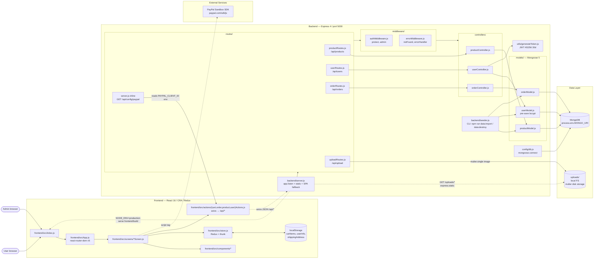
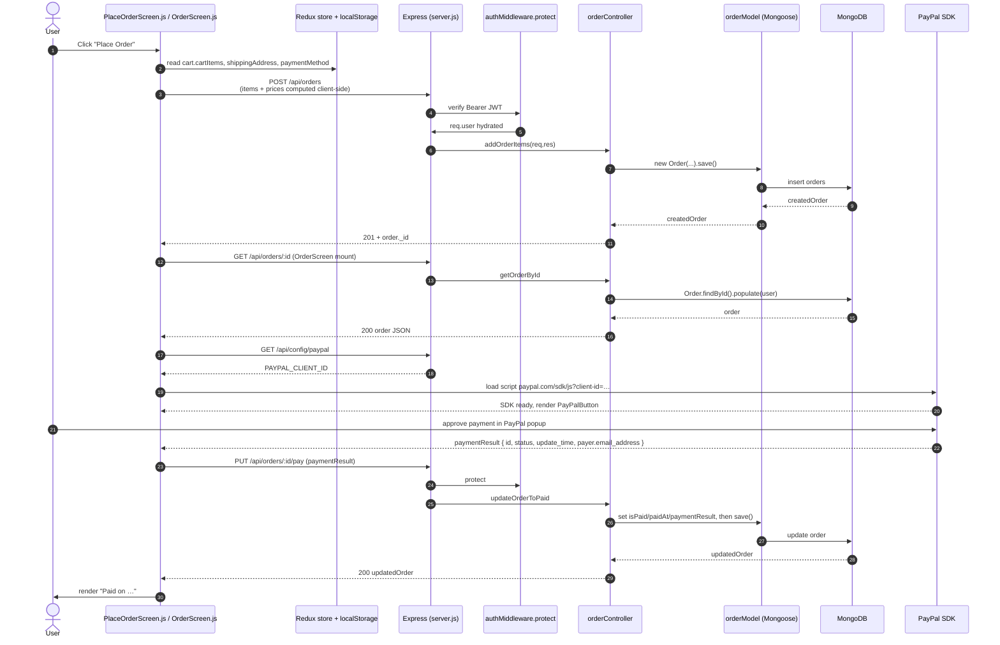

# Architecture — proshop_mern

MERN single-page app. React 16 / CRA dev server (port 3000) talks to Express 4 API (port 5000) via the `/api/*` proxy declared in `frontend/package.json`. In production `backend/server.js` runs alone on a single port and serves `frontend/build` as static, so the SPA and the API share an origin.

- **Auth**: JWT HS256, 30-day expiry, `Authorization: Bearer …` headers (`backend/utils/generateToken.js`, `backend/middleware/authMiddleware.js`).
- **State**: classic Redux + `redux-thunk`; `localStorage` is the source of truth for `cartItems`, `userInfo`, `shippingAddress` (`frontend/src/store.js`).
- **Persistence**: MongoDB via Mongoose 5 (`backend/config/db.js`); product images on local filesystem (`uploads/`, ephemeral on Heroku).
- **External**: PayPal Sandbox SDK loaded as `<script>` from `paypal.com/sdk/js`; client-id fetched at runtime from `GET /api/config/paypal`.

## C4 — Container diagram

## Data flow — «User places an order and pays with PayPal»

## Entry points cheat sheet

| Kind | Where | Purpose |
|---|---|---|
| HTTP | `backend/server.js` | Composes routes, error middleware, prod static fallback |
| HTTP | `backend/routes/productRoutes.js` | `/api/products`, `/api/products/:id`, `/api/products/top`, reviews |
| HTTP | `backend/routes/userRoutes.js` | `/api/users`, `/api/users/login`, `/api/users/profile`, admin CRUD |
| HTTP | `backend/routes/orderRoutes.js` | `/api/orders`, `/api/orders/:id`, `/pay`, `/deliver`, `/myorders` |
| HTTP | `backend/routes/uploadRoutes.js` | `POST /api/upload` (multer disk → `uploads/`) |
| HTTP inline | `backend/server.js` | `GET /api/config/paypal` returns `PAYPAL_CLIENT_ID` |
| Static | `backend/server.js` | `GET /uploads/*` (image hosting), `*` SPA fallback in prod |
| CLI | `backend/seeder.js` | `npm run data:import` / `npm run data:destroy` |
| SPA | `frontend/src/index.js` → `App.js` | All routes are React Router v5 client-side |
