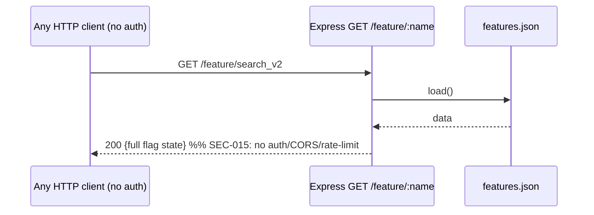

# Spec — Feature-Flags MCP (`mcp-feature-flags/server.ts`)

> Reverse-engineered M6 Stage 3 (4-step pattern). Source of truth: `backend/features.json`. Findings cross-referenced from `homework/M6/stage1-code-review/synthesis.md`.

## 1. Overview

A TypeScript MCP server (`@modelcontextprotocol/sdk` + `zod`) that is the **only sanctioned writer** of `backend/features.json` (resolved relative to the compiled `dist/server.js` as `../../backend/features.json`). It exposes four tools and runs over two transports.

**Tools:**
- `get_feature_info({feature_name})` — full state of one flag + each dependency's current status (`dependencies_state`).
- `set_feature_state({feature_name, state})` — `state ∈ {Disabled, Testing, Enabled}`. Auto-derives `traffic_percentage` (Disabled→0, Enabled→100, Testing→keep if 1-99 else 10), stamps `last_modified=today`. Refuses `Enabled` if any dependency is `Disabled`.
- `adjust_traffic_rollout({feature_name, percentage})` — integer `[0,100]`; sets traffic only (not status); stamps `last_modified`. Hard-locks: refuses `percentage>0` while status is `Disabled`.
- `list_features({})` — compact inventory `[{feature_name,name,status,traffic_percentage}]`, sorted by name.

**Persistence:** `load()` = `JSON.parse(readFile(FILE))` on every tool call; `save()` writes `FILE.tmp` then `rename` (atomic swap on same volume). No in-memory cache; no cross-process lock.

**Transports:**
- **stdio** (default) — `buildServer()` + `StdioServerTransport`; used by Claude Code / desktop.
- **`--http`** (or `MCP_TRANSPORT=http`) on `MCP_HTTP_PORT` (default 5680) — Express app with: stateless `POST /mcp` (fresh server+transport per request), legacy `GET /mcp` (SSE, session map), `POST /mcp/message?sessionId=`, no-op `DELETE /mcp`, `GET /health`, and an **unauthenticated** read-only REST shortcut `GET /feature/:feature_name`. A request tracer logs every hit. `express.json({limit:"4mb"})`.

**The business invariants** (dependency-gate + disabled-traffic-lock + Testing-traffic-default) are the reason CLAUDE.md forbids editing `features.json` directly — they live only here. Stage 1 ARCH-001 flags that `backend/utils/featureFile.js` re-implements a subset and writes the file directly, creating a second writer.

## 2. Decision Table

| # | Condition | Then | Else | Edge case |
|---|---|---|---|---|
| 1 | `feature_name` not a key in data (any tool) | return `{error:"FEATURE_NOT_FOUND", feature_name}` | proceed | accessor names (`toString`,`constructor`) — `!f` truthy-check (SEC-016) |
| 2 | `set_feature_state`, `state==="Enabled"`, some dep `status==="Disabled"` | return `DEPENDENCY_NOT_ENABLED` + `blocking_dependencies` | apply state | dep key MISSING → `data[d]?.status` is `undefined`, not `"Disabled"` → NOT blocking |
| 3 | `set_feature_state`, state derive traffic | Disabled→0, Enabled→100 | Testing→ keep if `1≤tp≤99` else 10 | `tp` absent/NaN → falls to 10 |
| 4 | `adjust_traffic_rollout`, status `Disabled` & `percentage>0` | return `DISABLED_TRAFFIC_LOCKED` | set tp | `percentage===0` on Disabled → allowed (no-op-ish) |
| 5 | `adjust_traffic_rollout`, `percentage` non-int / out of `[0,100]` | zod rejects before handler | set tp | zod `.int().min(0).max(100)` |
| 6 | `adjust_traffic_rollout`, tp hits 0 / 100-on-Testing | append `hint` to nudge `set_feature_state` | `hint=null` | hint is advisory only |
| 7 | transport: `--http` flag or `MCP_TRANSPORT=http` | start Express on `MCP_HTTP_PORT` | stdio | port collision → unhandled `listen` error |
| 8 | `POST /mcp` handler throws & headers not sent | 500 JSON-RPC `-32603` | stream response | headers already sent → error swallowed |
| 9 | `GET /feature/:name`, name missing | 404 `FEATURE_NOT_FOUND` | 200 flag + deps_state | param used directly as object key (SEC-016) |
| 10 | `POST /mcp/message`, unknown `sessionId` | 404 `UNKNOWN_SESSION` | dispatch to transport | SSE session map is in-memory, lost on restart |

## 3. Sequence Diagram

```mermaid
sequenceDiagram
  autonumber
  participant Cl as MCP client (CC / n8n)
  participant S as server.ts tool
  participant F as backend/features.json (fs)

  Note over Cl,S: set_feature_state(feature, "Enabled")
  Cl->>S: tool call (zod-validated args)
  S->>F: load() = readFile + JSON.parse
  F-->>S: data
  alt feature missing
    S-->>Cl: {error:FEATURE_NOT_FOUND}
  else dependency Disabled
    S->>S: blocking = deps where data[d].status==="Disabled"
    S-->>Cl: {error:DEPENDENCY_NOT_ENABLED, blocking}
  else ok
    S->>S: status=Enabled; traffic=100; last_modified=today
    S->>F: save() = writeFile(tmp) + rename
    S-->>Cl: {feature_name,status,traffic,last_modified,dependencies_state}
  end
```

Error path (HTTP REST shortcut, unauthenticated):


## 4. Edge Cases (≥10)

1. **No auth on HTTP transport (SEC-015)** — `POST/GET/DELETE /mcp`, `GET /feature/:name` are open; anyone reaching port 5680 can read and flip flags (incl. kill-switch live traffic).
2. **URL param as object key (SEC-016)** — `data[req.params.feature_name]`; `!f` truthy-check lets `constructor`/`toString` return junk truthy objects instead of 404; one refactor from prototype pollution.
3. **Dual-writer race (PERF-006 / ARCH-001)** — Express `featureFile.js` and this MCP both write `features.json` with no shared lock; interleaved `save()`s can lose updates (last-rename-wins).
4. **No cache, reread per call (PERF-006)** — `load()` re-parses on every tool; n8n flow calling `list_features` + N×`get_feature_info` = N+1 disk reads.
5. **Missing dependency key** — `data[d]?.status === undefined` (not `"Disabled"`) → dependency treated as non-blocking; a typo'd dependency silently passes the gate.
6. **Testing traffic default** — enabling Testing with `traffic_percentage` absent/NaN/0 → forced to 10; surprising if caller expected to preserve 0.
7. **`adjust_traffic_rollout` to 0 on a Testing flag** — allowed, leaves status Testing with 0% (live-dark); only a hint nudges the kill-switch.
8. **Concurrent stateless POST /mcp** — each request builds a fresh `McpServer`; fine for isolation but multiplies `load()` cost under burst.
9. **SSE session loss on restart** — `sseTransports` map is in-memory; a server restart 404s every in-flight SSE `POST /mcp/message`.
10. **`save()` atomicity is volume-scoped** — `rename(tmp, FILE)` is atomic only on the same filesystem; a future tmpdir on another volume breaks atomicity.
11. **Partial write visibility** — between `load()` and `save()` a concurrent Express write is clobbered; no read-modify-write guard.
12. **`4mb` JSON body limit** — generous for a flags API; widens DoS surface on the HTTP transport (cross-ref SEC-015).
13. **`last_modified` granularity** — `today()` is date-only (`YYYY-MM-DD`); two changes same day are indistinguishable in the timestamp.
14. **Enum case-sensitivity** — `state` must be exactly `Disabled|Testing|Enabled`; lower-case input is a zod rejection, not a 400 with guidance.
15. **No audit trail** — flips aren't logged anywhere durable (cross-ref SEC-018); post-incident reconstruction is impossible.

## 5. Open Questions

- Should the Express backend (`featureFile.js`) become an MCP **client** instead of a second writer? (ADR-0004 proposed in Stage 1.)
- Is the HTTP transport ever exposed beyond loopback in deployment (n8n docker / ngrok)? If yes, SEC-015 is critical, not medium.
- Is there a canonical schema for a flag object (required fields)? Tools assume `status`, `traffic_percentage`, optional `dependencies`.

## 6. Suggested Characterization Tests

- `set_feature_state(Enabled)` with a Disabled dependency → `DEPENDENCY_NOT_ENABLED` + correct `blocking_dependencies`.
- `set_feature_state(Testing)` derives traffic: tp=50 kept; tp=0/absent → 10; tp=100 kept (1-99? no → 10... assert exact rule).
- `adjust_traffic_rollout(percentage=25)` on Disabled flag → `DISABLED_TRAFFIC_LOCKED`; on Testing flag → tp set + `last_modified` bumped.
- `get_feature_info` unknown name → `FEATURE_NOT_FOUND`; known name → `dependencies_state` lists each dep status.
- `GET /feature/:name` (HTTP) returns 200 for known, 404 for unknown — and documents the **absence** of auth (security regression test target).
