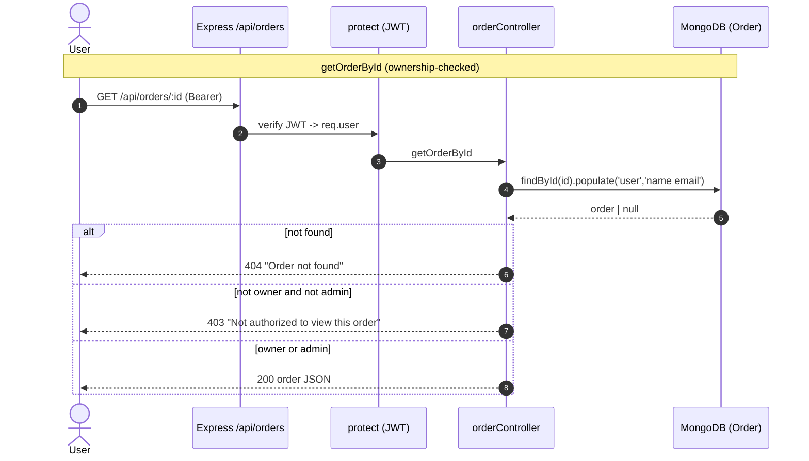

# Spec — Order Controller (`backend/controllers/orderController.js`)

> Reverse-engineered M6 Stage 3 (4-step pattern). Reflects code **after** Stage 2 fix #1 (SEC-001). Findings cross-referenced from `homework/M6/stage1-code-review/synthesis.md` and `FINDINGS.md` (prior audit).

## 1. Overview

The order lifecycle controller. Six `asyncHandler`-wrapped handlers behind `/api/orders`, mounted with `protect` (authn) and `admin` per route in `orderRoutes.js`. There is **no service layer** — orchestration lives in the controller (ARCH-004) — and **no resource-authorization layer** beyond the per-handler checks (ARCH-002).

| Handler | Route | Access | Purpose |
|---|---|---|---|
| `addOrderItems` | `POST /api/orders` | private | Create order from client-supplied items + **client-supplied prices** |
| `getOrderById` | `GET /api/orders/:id` | private | Fetch one order; **ownership-checked** (Stage 2 fix #1): 403 unless owner or admin |
| `updateOrderToPaid` | `PUT /api/orders/:id/pay` | private | Mark paid + store `paymentResult` from body (**no ownership / no PayPal verify** — SEC-002 open) |
| `updateOrderToDelivered` | `PUT /api/orders/:id/deliver` | admin | Mark delivered |
| `getMyOrders` | `GET /api/orders/myorders` | private | All orders for `req.user._id` (no pagination — PERF-003) |
| `getOrders` | `GET /api/orders` | admin | **All** orders, `.populate('user')`, no pagination (PERF-002) |

**Persistence:** Mongoose 5 `Order` model. `addOrderItems` does `new Order(...).save()`; the update handlers do `findById → mutate fields → save()`.

**Known correctness gaps (FINDINGS.md):** `addOrderItems` trusts `itemsPrice/taxPrice/shippingPrice/totalPrice` from the body (price tampering, FINDINGS#2 / SEC-002 family); the empty-items guard `if (orderItems && orderItems.length === 0)` lets `null`/`undefined` through and has dead code after `throw` (FINDINGS#4).

## 2. Decision Table

| # | Condition | Then | Else | Edge case |
|---|---|---|---|---|
| 1 | `addOrderItems`: `orderItems && length===0` | 400 "No order items" (+ dead `return`) | create + 201 | `null`/`undefined` orderItems slip through → invalid-schema save → 500 (FINDINGS#4) |
| 2 | `addOrderItems`: prices in body | persisted verbatim | — | client can send `totalPrice:0.01` (FINDINGS#2) |
| 3 | `getOrderById`: order found | check ownership | 404 "Order not found" | populated `user._id` vs raw `user` handled |
| 4 | `getOrderById`: ownerId !== req.user._id AND !isAdmin | **403 "Not authorized to view this order"** | 200 order | admin bypass; owner allowed (fix #1) |
| 5 | `updateOrderToPaid`: order found | set isPaid/paidAt/paymentResult, save | 404 | **no ownership check (SEC-002)**; any user pays any order |
| 6 | `updateOrderToPaid`: `req.body.payer` undefined | throws on `.email_address` → 500 | sets email | malformed PayPal body → 500 not 400 |
| 7 | `updateOrderToDelivered`: order found | set isDelivered/deliveredAt, save | 404 | admin-gated at route only |
| 8 | `getMyOrders` | `find({user})` → all | — | no limit/sort/index (PERF-003) |
| 9 | `getOrders` | `find({}).populate('user','id name')` | — | unbounded; OOM at scale (PERF-002) |

## 3. Sequence Diagram



Payment path (SEC-002 — unguarded today):
```mermaid
sequenceDiagram
  actor A as Any logged-in user
  participant OC as updateOrderToPaid
  participant DB as MongoDB
  A->>OC: PUT /api/orders/:victimId/pay {paymentResult}
  OC->>DB: findById(victimId)
  DB-->>OC: order (NOT ownership-checked)
  OC->>DB: isPaid=true; paymentResult=body; save()  %% no PayPal verify
  OC-->>A: 200 updatedOrder
```

## 4. Edge Cases (≥10)

1. **Price tampering (FINDINGS#2 / SEC-002 family)** — `addOrderItems` stores client prices; an attacker orders for `totalPrice: 0.01`.
2. **Empty-body order (FINDINGS#4)** — `null`/`undefined` `orderItems` bypasses the guard → schema-invalid `save()` → 500 instead of 400; dead `return` after `throw`.
3. **Mark-any-order-paid (SEC-002)** — `updateOrderToPaid` has no ownership check and no server-side PayPal capture verification; a logged-in user marks a stranger's order paid with a fabricated `paymentResult`.
4. **Malformed PayPal body** — `req.body.payer.email_address` throws if `payer` is absent → 500 (unhandled shape).
5. **IDOR (SEC-001) — FIXED** — non-owner now gets 403; regression risk if a future `/:id` handler forgets the check (ADR-0005 argues for a shared authz middleware).
6. **getOrders unbounded (PERF-002)** — entire collection serialized; 200-600ms @10k, OOM @100k.
7. **getMyOrders unbounded (PERF-003)** — no limit/sort; no `{user:1}` index.
8. **No idempotency on pay** — repeated `PUT /pay` re-stamps `paidAt` each time; double-submit overwrites.
9. **`Date.now()` for paidAt/deliveredAt** — server clock; no timezone/skew handling.
10. **Ownership compare relies on populate** — `getOrderById` uses `.populate('user')`; `order.user._id` exists only because of populate. The fix guards `order.user._id ? … : order.user` so a future un-populated read still compares correctly.
11. **No order-status state machine** — deliver can be set before paid; no invariant enforces pay→deliver ordering.
12. **Admin gate is route-level only** — `getOrders`/`updateOrderToDelivered` rely on `admin` in `orderRoutes.js`; controller doesn't re-assert (defense-in-depth gap).
13. **No audit log (SEC-018)** — payment/delivery state changes aren't logged for post-incident reconstruction.
14. **populate field mismatch** — `getOrders` populates `'id name'` (note `id` not `_id`); harmless but inconsistent with `getOrderById`'s `'name email'`.

## 5. Open Questions

- Move ownership/authz into `backend/middleware/authz.js` (ADR-0005) so every `/:id` route is protected by default?
- Recompute prices server-side from `Product.findById` in `addOrderItems` (closes FINDINGS#2) — is the price contract owned by client or server?
- Add server-side PayPal capture verification in `updateOrderToPaid` (closes SEC-002)?

## 6. Suggested Characterization Tests

- `getOrderById`: owner→200; non-owner→403; admin→200; missing→404 *(already implemented in Stage 2 fix-1 tests)*.
- `addOrderItems`: empty `orderItems:[]`→400; `orderItems:undefined`→ current 500 behavior (pins FINDINGS#4 before any fix); valid→201 with persisted prices (pins FINDINGS#2 client-trust).
- `updateOrderToPaid`: non-owner marks paid→ current 200 (pins SEC-002 before fix); missing order→404; body without `payer`→500 (pins #4 above).
- `getMyOrders`: returns only `req.user._id` orders (filter correctness).
- `getOrders`: returns all + populated user (shape), no pagination params honored (pins PERF-002).
