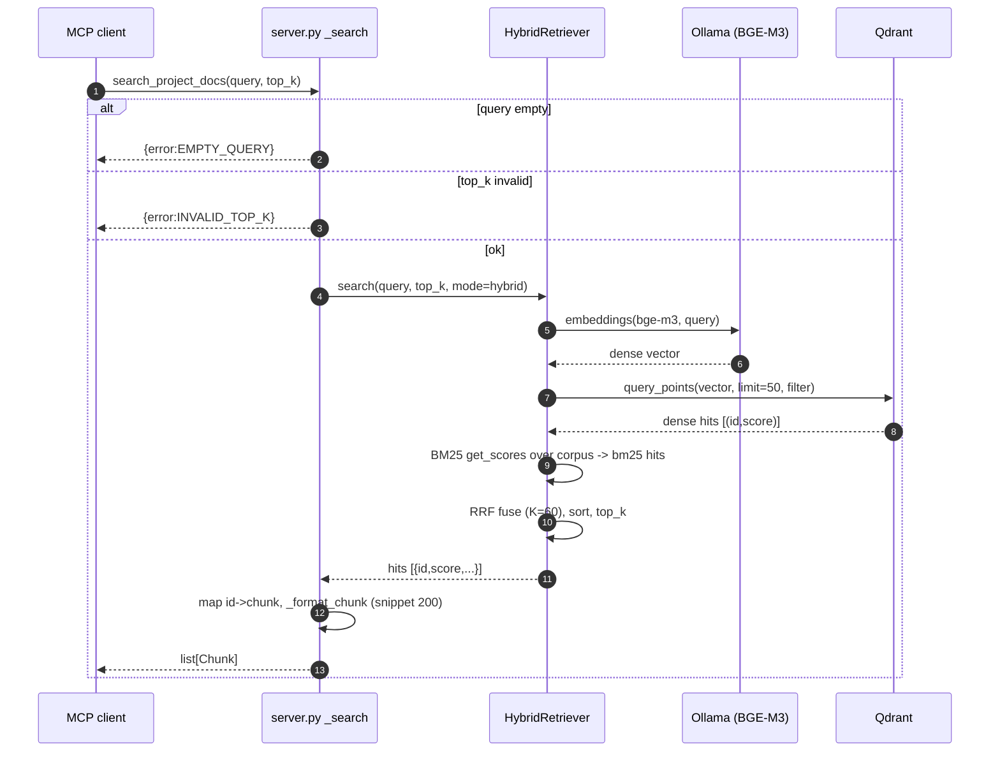
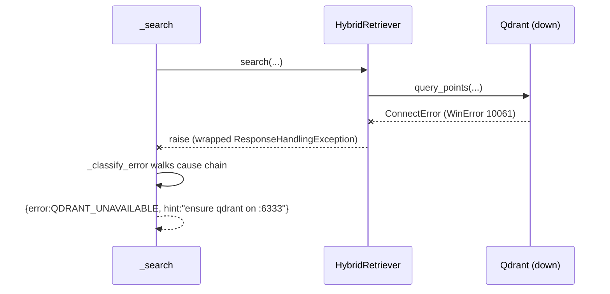

# Spec — Project-Docs RAG MCP (`mcp-project-docs/server.py` + `scripts/rag_query.py`)

> Reverse-engineered M6 Stage 3 (4-step pattern). Findings cross-referenced from `homework/M6/stage1-code-review/synthesis.md`.

## 1. Overview

A Python MCP server (`mcp.server.fastmcp.FastMCP`) exposing **one tool**, `search_project_docs(query, top_k=5)`, over stdio. It wraps `scripts/rag_query.HybridRetriever`, which does **hybrid retrieval** over the proshop doc corpus: dense (BGE-M3 embeddings via Ollama, searched in Qdrant) fused with sparse (BM25 over title+summary+keywords+text) using **Reciprocal Rank Fusion** (RRF, `K=60`, `PREFETCH_LIMIT=50` candidates per retriever).

**Data dependency (critical):** at import the module instantiates a module-level singleton `_retriever = HybridRetriever(chunks_path=docs/chunks.jsonl, …)`. The constructor reads **all** of `docs/chunks.jsonl`, tokenizes every chunk, and builds an in-memory `BM25Okapi`. Qdrant/Ollama clients are lazy (constructed but not contacted) — connection failures surface per-query and are classified. **`docs/chunks.jsonl` + `docs/project-data/` are runtime data for this server; they are not "docs to reorganize".**

**Config via env:** `PROSHOP_CHUNKS_PATH`, `PROSHOP_COLLECTION` (default `proshop_chunks`), `QDRANT_URL` (`:6333`), `OLLAMA_HOST` (`:11434`).

**Output contract:** success → `list[Chunk]` each `{source_file, file_path, title, parent_headings, score, snippet(≤200ch)}`; error → structured dict with `error ∈ {EMPTY_QUERY, INVALID_TOP_K, QDRANT_UNAVAILABLE, OLLAMA_UNAVAILABLE, EMBED_MODEL_UNAVAILABLE, INTERNAL}` + `message`/`hint`.

**Retrieval modes** (`HybridRetriever.search`): `dense`, `bm25`, `hybrid`. Dense uses a Qdrant payload filter; BM25 applies the same filter as a Python predicate **after** scoring. The MCP always calls `mode="hybrid", group=None, source_file=None`; the CLI (`rag_query.py main`) exposes mode/group/source-file/--with-text.

**`sys.path.insert(0, REPO_ROOT)`** makes `scripts/` importable (SEC-017: lets a repo-local `mcp.py`/`scripts/*.py` shadow installed packages; import-time singleton runs any side-effects on start).

## 2. Decision Table

| # | Condition | Then | Else | Edge case |
|---|---|---|---|---|
| 1 | `query` empty / whitespace | `{error:EMPTY_QUERY}` | proceed | `"   "` → stripped empty |
| 2 | `top_k` not int OR `<1` OR `>50` | `{error:INVALID_TOP_K}` | proceed | `top_k=0`, `top_k=51`, float |
| 3 | retriever raises, conn-chain matches | classify `QDRANT_UNAVAILABLE` / `OLLAMA_UNAVAILABLE` | next branch | walks `__cause__`/`__context__`; WinError 10061/10060 |
| 4 | both qdrant & ollama could match | prefer QDRANT if host string matches & not ollama | else OLLAMA | ambiguity when both on localhost |
| 5 | msg mentions model not found/pull | `EMBED_MODEL_UNAVAILABLE` (bge-m3) | `INTERNAL` | "model … does not exist" |
| 6 | hit `id` absent from `_id_to_chunk` | skip the hit | append formatted | Qdrant has id not in local chunks (drift) |
| 7 | `mode==="dense"` | order = dense[:top_k] | — | Qdrant down → conn error |
| 8 | `mode==="bm25"` | order = bm25[:top_k] | — | empty `q_tokens` (all ≤1 char) → `[]` |
| 9 | `mode==="hybrid"` | RRF-fuse dense+bm25, sort, top_k | — | one retriever empty → other still ranks |
| 10 | token length ≤ 1 | dropped by `_tokenize` | kept | single-char queries lose all tokens |
| 11 | snippet > 200 chars | cut at last space + "…" | return collapsed | no space in first 200 → hard cut |

## 3. Sequence Diagram

Error path:

## 4. Edge Cases (≥10)

1. **Import-time singleton (PERF-007 / SEC-017)** — `_retriever` built at import: reads all chunks + builds BM25 on every stdio spawn (50-300ms cold @600 chunks; 1-3s + 50-100MB @10k). `sys.path.insert` lets repo-local modules shadow installed packages.
2. **BM25 O(N) per query (PERF-008)** — `get_scores` scores the entire corpus, filters **after** scoring, full Python sort O(N log N). Latent at 600 chunks (~5-15ms), dominant at 50k (~0.5-1s).
3. **Single-char / stopword-only query** — `_tokenize` drops tokens ≤1 char; a query of all short tokens yields empty `q_tokens` → BM25 returns `[]`; hybrid falls back to dense only.
4. **Qdrant/local chunk drift (#6)** — a Qdrant point whose `id` isn't in `docs/chunks.jsonl` is silently skipped → fewer than `top_k` results with no warning.
5. **Connection-class misclassification (#4)** — if both Ollama and Qdrant run on localhost and the error message lacks a distinguishing host/port, classification can mislabel which service is down.
6. **Embedding model missing** — `ollama pull bge-m3` not done → `EMBED_MODEL_UNAVAILABLE`; dense path dead, but `mode="hybrid"` still raises (embeddings called first) rather than degrading to BM25-only.
7. **`top_k` float** — `isinstance(top_k,int)` rejects `5.0` as `INVALID_TOP_K` (strict); a JSON client sending a float gets an error, not coercion.
8. **Snippet with no spaces** — a 200+ char token (e.g. base64) → `rfind(" ")` returns ≤0 → hard cut at `max_len-1`.
9. **Unicode tokenization** — `\w+` with `re.UNICODE`; CJK without spaces tokenizes poorly → BM25 recall drops for non-Latin queries.
10. **RRF ignores raw scores** — fusion uses **rank only** (`1/(K+rank+1)`); a hugely-confident dense top-1 ties with a mediocre BM25 top-1 at the same rank weight.
11. **No `top_k` upper guard at fusion** — capped to 50 by `INVALID_TOP_K`, but `PREFETCH_LIMIT=50` means `top_k=50` returns whatever fusion surfaces from ≤100 candidates (recall ceiling).
12. **chunks.jsonl malformed line** — `json.loads` per non-blank line; one bad line raises at import → server won't start (fail-fast, but opaque).
13. **No query length cap** — a multi-KB query is embedded as-is (Ollama cost) and tokenized fully.
14. **Concurrency** — stdio server is single-process; parallel tool calls serialize on the GIL during BM25 scoring.

## 5. Open Questions

- Persist/pickle the BM25 index keyed by `chunks.jsonl` mtime to kill per-spawn rebuild (PERF-007)? Or move sparse vectors into Qdrant?
- Should `mode="hybrid"` degrade to BM25-only when Ollama is down, instead of erroring?
- Is `top_k` float-coercion desirable for lenient clients, or is strict-int intentional?

## 6. Suggested Characterization Tests

- `_search("", 5)` → `EMPTY_QUERY`; `_search("q", 0)` / `_search("q", 51)` / `_search("q", 5.0)` → `INVALID_TOP_K`.
- `_classify_error` with a synthetic `ConnectError("WinError 10061 … :6333")` → `QDRANT_UNAVAILABLE`; with `"model bge-m3 not found, pull"` → `EMBED_MODEL_UNAVAILABLE`; with a generic `ValueError` → `INTERNAL`.
- `_make_snippet` — string ≤200 returned whole; >200 cut at last space + "…"; no-space 250-char string hard-cut to 199+"…".
- `HybridRetriever.search(mode="bm25")` with a stub `_chunks` and a single-char query → `[]` (tokenizer drop).
- RRF fusion: with stubbed dense=[a,b], bm25=[b,c], assert `b` ranks first (appears in both) and result length ≤ top_k.
